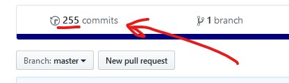
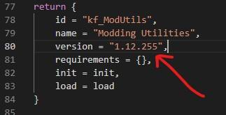

# ItB Mod Utilities

This is a collection of various Lua modules useful for creators of mods for the game [Into the Breach](https://www.subsetgames.com/itb.html).


## Features

For an almost-complete list of modules and functions, [click here](docs.md)

For an exhaustive list of new hooks, [click here](hooks.md)


## Usage

1. Create a folder named `modApiExt` inside of your mod's `scripts` directory, and place all of ModUtils' `.lua` files there. To illustrate, the directory structure should look like this:

```
+ My_Mod/
+--+ scripts/
   +--+ modApiExt/
   |  +-- modApiExt.lua
   |  +-- [other ModUtils .lua files]
   +-- init.lua  [your mod's init file]
```

2. In your mod's `init.lua`, add `"kf_ModUtils"` entry to the `requirements` table:

```lua
return {
	id = "MyModId",
	name = "My Mod",
	version = "someversion",
	requirements = { "kf_ModUtils" }, -- <-- Here
	init = init,
	load = load,
}
```

3. Now, in your mod's `init.lua` do the following:

```lua
local function init(self)
	myname_modApiExt = require(self.scriptPath.."modApiExt/modApiExt"):init()

	-- Rest of your init function
end

local function load(self, options, version)
	myname_modApiExt:load(self, options, version)

	-- Rest of your load function
end

-- Rest of your init.lua file
```

...Where the `myname` in `myname_modApiExt` should be changed to some unique identifier that is very unlikely to be used by other mods. A good convention is first using a short of your nickname, followed by name of the mod you're working on. For example, when I (kartoFlane) was working on a snake Vek enemy mod, I named this variable `kf_snake_modApiExt`.

Now in your mod, you can use the `myname_modApiExt` variable to access any ModUtils functions you may need.

If you ever need to check whether the version you're running is the most recent one available to the player, or want to get the most recent version, you can use [`myname_modApiExt:isMostRecent()`](https://github.com/kartoFlane/ITB-ModUtils/blob/master/docs.md#modapiextismostrecent) and [`myname_modApiExt:getMostRecent()`](https://github.com/kartoFlane/ITB-ModUtils/blob/master/docs.md#modapiextgetmostrecent) respectively.


## Using mid-release versions

If you wish to use an in-development, not-yet-released version of modApiExt, you can clone this repository and use the contents of the `modApiExt` directory as-is in your mod.
**However**, if you do that, you have to change the version string in modApiExt's `init.lua` to indicate that it is a mid-release version. This ensures that things keep working correctly, and that the most recent version of the library will be used.

Basically, take the number of commits as seen on the repository's main page:



And append it to modApiExt's version after a dot (`.`), like so:


