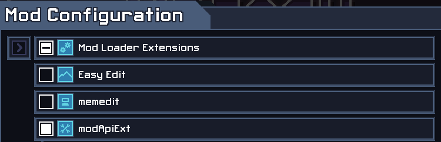

# ItB Mod Utilities

This is a collection of various Lua modules useful for creators of mods for the game [Into the Breach](https://www.subsetgames.com/itb.html).


## Features

For an almost-complete list of modules and functions, [click here](docs.md)

For an exhaustive list of new hooks, [click here](hooks.md)


## Usage

modApiExt is now part of the modloader extensions. In order to request modApiExt.lua add the `dependencies` table into your `init.lua`

```lua
return {
	id = "MyModId",
	name = "My Mod",
	version = "someversion",
	dependencies = {
		modApiExt = "1.22", --Note, version may be different
	},
	init = init,
	load = load,
}
```

Use `modapiext` to reference it, note, that it's in all lowercase. Upon restarting the game, the `modApiExt` extension in `Mod Loader Extensions` should automatically initalize and your mod should have access to it. 



If you ever need to check whether the version you're running is the most recent one available to the player, or want to get the most recent version, you can use [`myname_modApiExt:isMostRecent()`](https://github.com/kartoFlane/ITB-ModUtils/blob/master/docs.md#modapiextismostrecent) and [`myname_modApiExt:getMostRecent()`](https://github.com/kartoFlane/ITB-ModUtils/blob/master/docs.md#modapiextgetmostrecent) respectively.


## Using mid-release versions

Note: This section may be out of date. If you wish to use an in-development, not-yet-released version of modApiExt, you can clone this repository and use the contents of the `modApiExt` directory as-is in your mod.
**However**, if you do that, you have to change the version string in modApiExt's `init.lua` to indicate that it is a mid-release version. This ensures that things keep working correctly, and that the most recent version of the library will be used.

Basically, take the number of commits as seen on the repository's main page:


And append it to modApiExt's version after a dot (`.`), like so:


